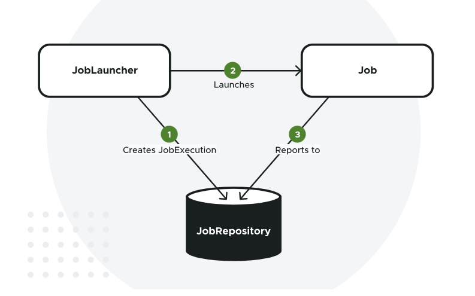

# Building a Batch Application with Spring Batch

## Introduction : 
In this course, we will introduce the fundamental concepts of batch processing and cover the main features of Spring Batch. You will build a complete batch application with Spring Batch and Spring Boot and learn how to implement robust and fault-tolerant batch solutions.

Spring Batch is a lightweight, comprehensive batch framework designed to enable the development of robust batch applications vital for the daily operations of enterprise systems.

## What we will as a demo ? 

- Build and run a fully functional batch application that generates billing reports for a fictional cell phone company.
- The application stores billing information in a relational database and generates a billing report. This application is based on Spring Boot and uses Spring Batch's features to create a robust batch processing system that is restartable and fault-tolerant.


The billing job is structured in the following steps:

- File preparation step: copies the file that contains the monthly usage for Spring Cellular's customers from a file server to a staging area.
- File ingestion step: ingests the file into a relational database table that contains the data used to generate the billing report.
- Report generation step: processes the billing information from the database table, and generates a flat file that contains data for the customers who have spent more than $150.00 USD.

## Spring Batch Overview
First of all we will describe what batch processing is, and the challenges that come with it. We also introduce the Spring Batch framework, explain its domain model, and its internal architecture
### Introduction to Batch Processing
Batch processing is a method of processing large volumes of data simultaneously, instead of processing them individually, in real time (in that case, we could talk about stream processing). This approach is widely used in many industries, including finance, manufacturing, and telecommunications. Batch processing is often used for tasks that require the processing of large amounts of data, such as payroll processing or billing, as well as tasks that require time-consuming calculations or analysis. Batch applications are ephemeral, which means that once they've completed, they end.

This type of processing comes with a number of challenges, including, but not limited to:

- Handling large amounts of data efficiently
- Tolerance to human errors and hardware deficiencies
- Scalability

When it's time to provide a batch-based application for processing large amounts of data in a structured way, Spring Batch provides a robust and efficient solution. So, what is Spring Batch exactly? How does it help address batch processing challenges? Let's find out!

### Spring Batch Framework
Spring Batch is a lightweight, comprehensive framework, designed to enable the development of robust batch applications that are vital for the daily operations of enterprise systems.

It provides all the necessary features that are essential for processing large volumes of data, including transaction management, job processing status, statistics, and fault-tolerance features. It also provides advanced scalability features that enable high-performance batch jobs through multi-threaded processing and data-partitioning techniques. You can use Spring Batch in both simple use cases (such as loading a file into a database), and complex, high-volume use cases (like moving data between databases, transforming it, and so on).

Spring Batch integrates seamlessly with other Spring technologies, making it an excellent choice for writing batch applications with Spring.

## Batch Domain Language
The key concepts of the Spring Batch domain model are represented in the following diagram:


* A Job is an entity that encapsulates an entire batch process, that runs from start to finish without interruption. A Job has one or more steps. A Step is a unit of work that can be a simple task (such as copying a file or creating an archive), or an item-oriented task (such as exporting records from a relational database table to a file), in which case, it would have an ItemReader, an ItemProcessor (which is optional), and an ItemWriter.
* A Job needs to be launched with a JobLauncher, and can be launched with a set of JobParameters. Execution metadata about the currently running Job is stored in a JobRepository.

## Batch Domain model 

* Spring Batch uses a robust and well-designed model for the batch processing domain. It provides a rich set of Java APIs with interfaces and classes that represent all of the key concepts of batch processing like Job, Step, JobLauncher, JobRepository, and more
* While the batch domain model can be implemented with any persistence technology (like a relational database, a non-relational database, a graph database, etc), Spring Batch provides a relational model of the batch domain concepts with metadata tables that closely match the classes and interfaces in the Java API.
* The following entity-relationship diagram presents the main metadata tables:


* __Job_Instance__: This table contains all information relevant to a job definition, such as the job name and its identification key.
* __Job_Execution__: This table holds all information relevant to the execution of a job, like the start time, end time, and status. Every time a job is run, a new row is inserted in this table.
* __Job_Execution_Context__: This table holds the execution context of a job. An execution context is a set of key/value pairs of runtime information that typically represents the state that must be retrieved after a failure.
* __Step_Execution__: This table holds all information relevant to the execution of a step, such as the start time, end time, item read count, and item write count. Every time a step is run, a new row is inserted in this table.
* __Step_Execution_Context__: This table holds the execution context of a step. This is similar to the table that holds the execution context of a job, but instead it stores the execution context of a step.
* __Job_Execution_Params__: This table contains the runtime parameters of a job execution.

## Understanding jobs and how to run them
### 1. What Is a Job?
* A Job is an entity that encapsulates an entire batch process that runs from start to finish. It consists of a set of steps that run in a specific order.
* A batch job in Spring Batch is represented by the Job interface provided by the spring-batch-core dependency:
* At a fundamental level, the Job interface requires that implementations specify the Job name (the getName() method) and what the Job is supposed to do (the execute method)
* The execute method gives a reference to a JobExecution object. TheJobExecution represents the actual execution of the Job at runtime. It contains a number of runtime details, such as the start time, the end time, the execution status, and so on. This runtime information is stored by Spring Batch in a metadata repository
* Note how the execute method isn't expected to throw any exception. Runtime exceptions should be handled by implementations, and added in the JobExecution object. Clients should inspect the JobExecution status to determine success or failure.
### 2.Understanding Job Metadata
* One of the key concepts in Spring Batch is the JobRepository. The JobRepository is where all metadata about jobs and steps is stored.
* A JobRepository could be a persistent store, or an in-memory store.
* A persistent store has the advantage of providing metadata even after a Job is finished, which could be used for post analysis or to restart a Job in the case of a failure
### 3.Launching Jobs
* Launching jobs in Spring Batch is done through the JobLauncher concept, which is represented by the following interface:
* ```java
  public interface JobLauncher {

   JobExecution run(Job job, JobParameters jobParameters)
          throws
             JobExecutionAlreadyRunningException,
             JobRestartException,
             JobInstanceAlreadyCompleteException,
             JobParametersInvalidException;}  
  ```
* The run method is designed to launch a given Job with a set of JobParameters. We'll cover job parameters in detail in a later lesson. For now, you can think of them as a collection of key/value pairs that are passed to the Job at runtime. There are two important aspects to understand here:
   * It is expected that implementations of the JobLauncher interface obtain a valid JobExecution from the JobRepository and execute the Job.
   * The run method throws different types of exceptions. We'll cover all of these exceptions in detail during the course.
* You'll almost never have to implement the JobLauncher interface yourself, because Spring Batch provides an implementation that's ready to use. The following diagram shows how the JobLauncher, the JobRepository and the Job interact with each other.



* Batch jobs are typically launched in one of two ways:
  * From the command line interface
  * From within a web container

== You will almost never have to implement that interface directly, as Spring Batch provides ready-to-use implementations like SimpleJob for simple sequential step-based jobs and FlowJob for jobs which requires a complex step execution flows. 